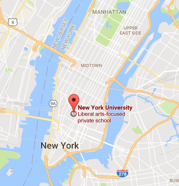

# Coding Sprint: Supervised Time Series

## When & Where

27th
- 31st of March, at New York University.

Room: To-be-announced.

[](https://www.google.fr/maps/place/New+York+University/@40.7295134,-73.9986549,17z/data=!3m1!4b1!4m5!3m4!1s0x89c2599af55395c1:0xda30743171b5f305!8m2!3d40.7295134!4d-73.9964609?hl=en)


## What & Why

By providing new techniques and new ways of looking at complex datasets, Machine Learning (ML) is currently revolutionizing many scientific fields.

The present coding sprint aims at gathering expert data-scientists, who specialize in high dimensional time series.

Our specific goal is to integrate i) the classic continuous signal processing techniques and ii) the main machine learning techniques within a common Python package, whose API follows [Scikit-Learn](http://scikit-learn.org)'s.

At the end of the coding sprint, user should be able to can for example build simple pipeline to `transform`, `fit`, `predict` and `score` their data & analyses of choice:

```python
estimator = make_pipeline(
    TimeFrequencyTransform(frequencies=range(1, 100)),
    GrangerCausality(),
    SearchLight(SVM(kernel='rbf'), axis='time'),
)

# or

estimator = make_pipeline(
    CSP(n_components=10),
    InverseOperator(info),
    SearchLight(Ridge(), axis='space'),
)

# such that we can do

estimator.transform(X, y)  # transform time series.
estimator.fit(X, y)  # transform & fit time series with machine learning algorithm.
estimator.predict(X, y)  # predict the class of each time series.
estimator.apply(X)  # transform time series to only keep relevant features.
```

The current group of developers is currently biased towards *neural* time series (EEG, MEG, ECoG, multi-unit neural recordings etc). However, we would particularly like to bridge this community to other fields that encounter similarly structured signals (music, speech, radar etc).

## Who

The current list of confirmed on-site developers are all core-contributors of [MNE](mne-tools.github.io):

- [Alexandre Barachant](http://alexandre.barachant.org) is a multi-winner of [Kaggle competitions](https://www.kaggle.com/alexandrebarachant) and currently specializes in decoding MEG and EEG signals using Riemannian Geometry.

- [Denis Engemann](http://www.denis-engemann.de), is an researcher at INRIA and currently specializes in large-scale analyses of EEG and MEG databases.

- [Alexandre Gramfort](http://alexandre.gramfort.net) is a Assistant Professor at Telecom ParisTech Université Paris-Saclay, [Scikit-Learn](http://scikit-learn.org) core developper and working on statistical machine learning and neuroscience data processing.

- [Chris Holdgraf](http://predictablynoisy.com/) is a grad student at University of California Berkeley and currently specializes in continuous encoding models.

- [Jean-Rémi King](https://sites.google.com/site/jeanremiking/) is a postdoc at NYU & FIAS and currently specializes in decoding M/EEG & ECoG signals.

- [Eric Larson](http://staff.washington.edu/larsoner/) is a research scientist at University of Washington, [Scipy](https://www.scipy.org/) working MEG data processing.

- [Mainak Jas](https://perso.telecom-paristech.fr/mjas/) is a grad student at Telecom ParisTech Université Paris-Saclay and currently specializes in denoising and modeling MEG signals.

- [Jona Sassenhagen](https://github.com/jona-sassenhagen) is a Postdoc at Uni. of Frankfurt and currently specializes in continuous encoding models.

- [Teon Brooks](http://teonbrooks.github.io) is a [Mozilla Science Fellow](https://science.mozilla.org/programs/fellowships/) and a postdoc at Stanford University and currently specializes in decoding M/EEG signals and eye movement behavior.

## Specific Goals

- [ ] ENH: Support regularized regression for decoding and encoding of continuous Signals. [hard]

- [ ] ENH: `apply` method for denoising. [hard]

- [ ] ENH: `get_filters` & `get_patterns` method to extract coefficient of linear models. [hard]

- [ ] ENH: add noise-ceiling example. [hard]

- [ ] ENH: add time frequency search light example. [easy]

- [ ] ENH: add source search light example. [hard]

- [ ] WIP: add oversampling & data enhancement. [easy]

- [ ] ENH: inter-subject decoding / hyper-alignment. [v. hard]

- [ ] FIX: Revamp temporal generalization analyses. [hard]

- [ ] FIX: XDawn decoding/preprocessing. [easy]

- [ ] DOC: simplify decoding gallery/examples & tutorials. [easy]

- [ ] DOC: make example statistics across subjects. [easy]

- [ ] DOC: make example

- [ ] DOC: add RSA example. [hard]


## Support or Contact

Anyone interested in joining is welcome to join us. You can contact jeanremi.king [at] gmail [dot] com for specific information.
